# KE7 | STOM

Web application that allows you to personalize your order using 3D graphics. This application was created for an engineering thesis and combines full e-commerce functionality with product personalization.

---

## Requirements

Make sure you have installed:

- Node.js
- npm

### Server Setup

1. Navigate to the server directory:

   ```bash
   cd Server
   ```
2. Run the server:

   ```bash
   npm run server
   ```

   Runs the server on http://localhost:5000

### App Setup

1. Navigate to the app directory:

   ```bash
   cd ke7-stom
   ```
2. Run the app:

   ```bash
   npm start
   ```

   Runs the app in development mode. Open http://localhost:3000 to view it in your browser.

---

## Interface

This chapter focuses on presenting the graphical interface of the application.

### Home Page

The home screen is the page where the user will find themselves immediately after launching the application. They will also be directed here after performing various actions, such as logging in. Users can always return to it by clicking on the KE7|STOM logo in the upper left corner.

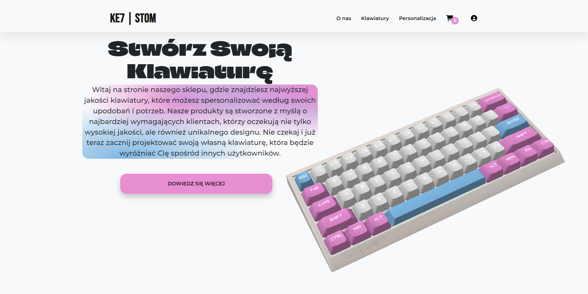

At the very top, there is a navigation bar available on every subpage. “O nas (About Us)” is a link to a subpage with information about a fictional company that manufactures keyboards. “Klawiatury (Keyboards)” is a link that allows users to navigate to a page with predefined keyboard variants available for order. “Personalizacja (Personalization)” takes the user to a subpage where they can choose which keyboard model they want to personalize. The cart icon is a link to the shopping cart. Next to it, there is a digit zero in a pink circle, representing the number of products currently in the cart. If the user is not logged in, the user icon is black and leads to the login page. After logging in, this icon changes its color to pink and directs the user to their account subpage.

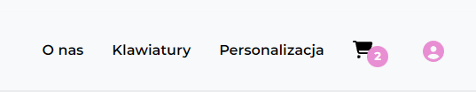

Below the navigation bar there is an informational section with a button linking to the “O nas” subpage and the keyboard model. This model gently rotates in response to mouse movement.

### Online Store

The online store screen is the page where the user will find themselves after clicking on the “Klawiatury” link or when they navigate to the /keyboard address. This page allows browsing and filtering all predefined keyboard variants, as well as accessing the detailed subpage about a single product.

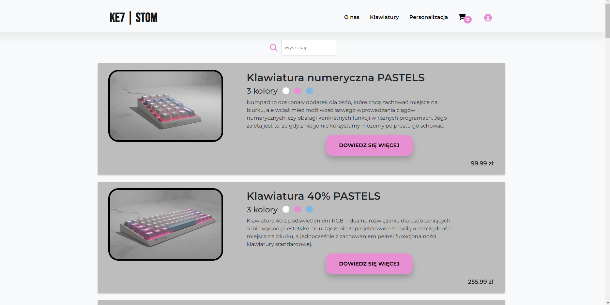

On the screen above, there is a search bar that allows users to filter products. Below it, all products are displayed with an image, title, graphical representation of colors using three circles, description, and price. Additionally, there are buttons “Dowiedz się więcej (Learn More)” which lead to a page with details about that product.

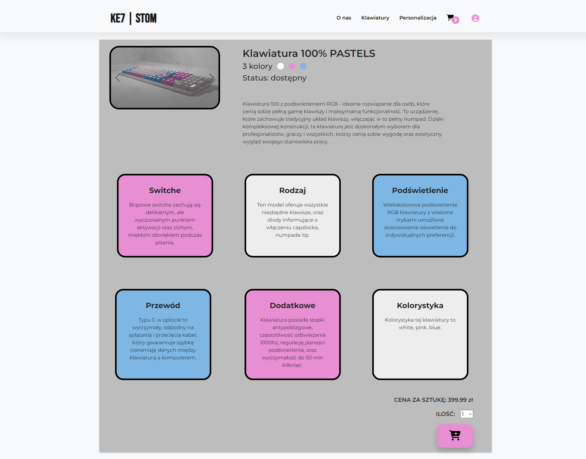

The details page enriches previously provided information with availability status, detailed information about switches, type of keyboard, backlighting, cable, and color options. Additionally, by clicking on the cart icon in the lower right corner of the screen, the user can add this product to the cart. Before adding, the user can increase the quantity of the product using a dropdown list next to the word “ILOŚĆ (Quantity)”. Moreover, instead of a single image, there is a carousel of images, which users can navigate through using arrows. By clicking on a specific image, a larger version opens in a modal, which can be closed by clicking outside the modal window.

### Personalization

The personalization screen is used to select the keyboard model that the user wants to personalize.

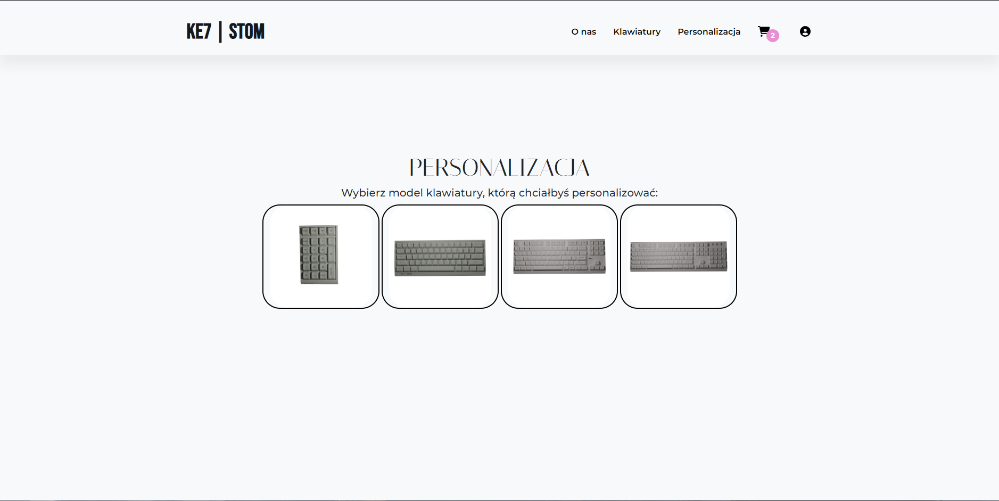

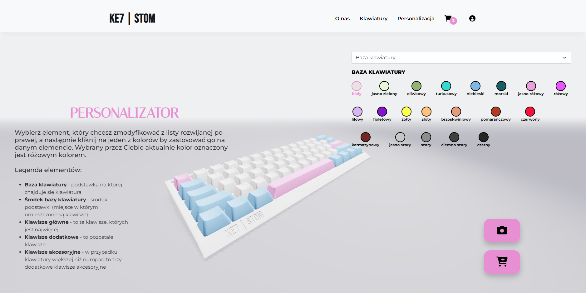

Above is the personalization screen. On the left side, there is a legend explaining the various elements that the user can personalize. In the center is the keyboard model, which can be rotated. The axis of rotation is locked so that the keyboard cannot be flipped upside down. On the right side, there is a dropdown list allowing the user to change the element currently being edited. Below it, all colors applicable to that element are visible. In the bottom right corner, there are two buttons, one allowing the Canvas to be saved as an image, and the other adds the product to the cart.

### Login

Users can access the login screen by clicking the user icon on the navigation bar, but only if they have not been previously logged in.

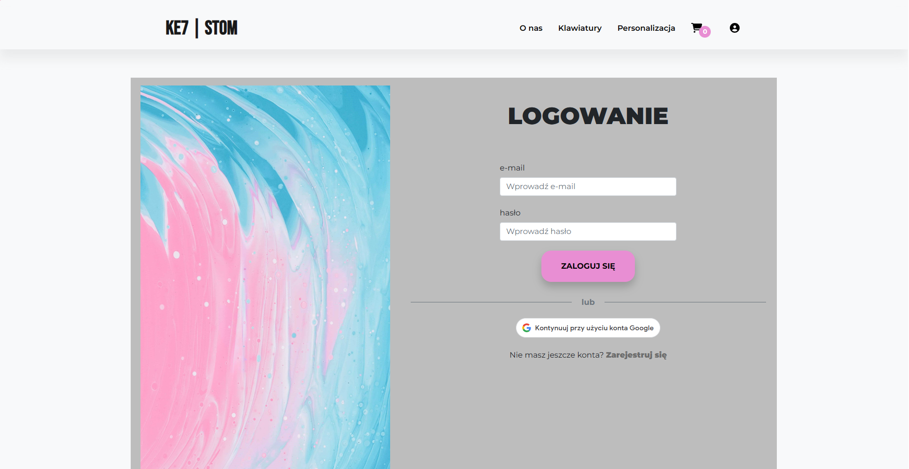

There are two options for logging in: by providing an email and password or by connecting with a Google account. If the user does not have an account, they can proceed to the registration screen by clicking on “Register.” When attempting to log in with incorrect credentials, an appropriate message will be displayed. After a successful login, the user is redirected to the home page.

### Registration

Users can be redirected to the registration screen from the login page. To register, they must provide their details and click the “Register” button or use a Google account.

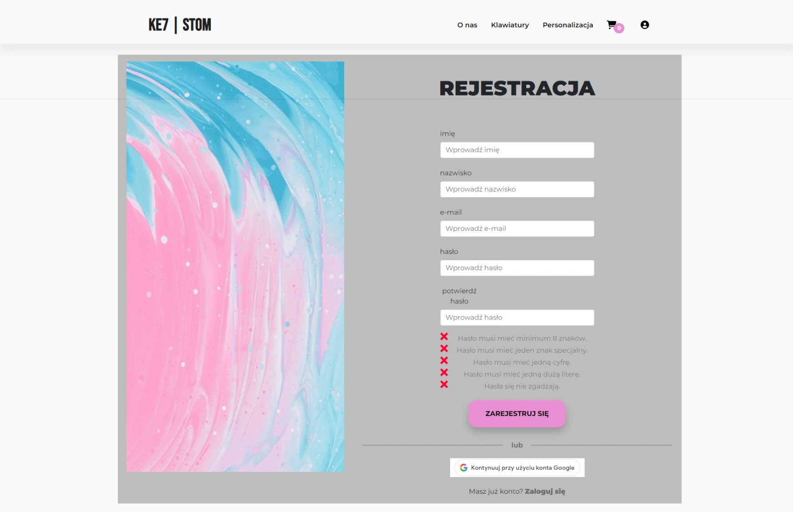

During the registration process, users are prompted to provide information such as: first name, last name, email, password, and to repeat the password. The password is validated. Initially, red crosses are displayed, which change to green checkmarks after specific conditions are met.

### Cart

Users can access the cart by clicking the cart icon on the navigation bar. The cart allows checking added products, editing quantities, and removing them. It displays prices for each product and the total cost. From the cart, users can place an order.

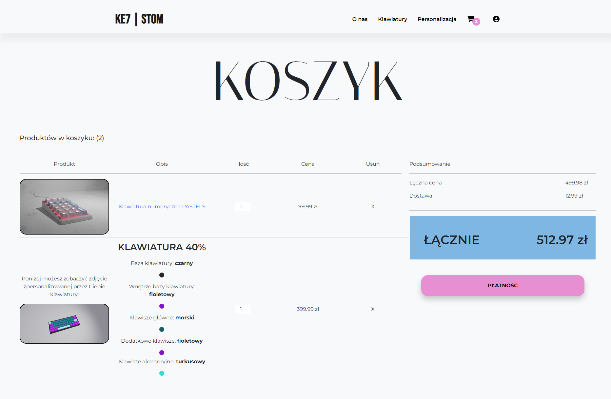

All products in the cart are displayed one under the other. Each standard product displays an image, name with a link to the detailed product page, quantity that can be increased/decreased (up and down arrows appear on hover), price, and an 'X' button to remove the product from the cart. For personalized keyboards, similar information is displayed, including an image generated from the canvas, with a note that describes the keyboard elements and the selected colors with a graphical representation for each. On the right side of the cart, the total price for keyboards in the cart, shipping costs, and the overall sum are displayed. By clicking the payment button, users are taken to the first step of placing an order.

### Order Placement

After clicking the payment button in the cart, users are redirected to the order placement screen. Here, they can review their order details and provide shipping information. On the order placement page, users must enter their shipping address, including street, city, postal code, and country. They also need to choose a payment method. If the user is not logged in, he is first taken to the login page. After inputing necessary information the user is taken to order confirmation page.

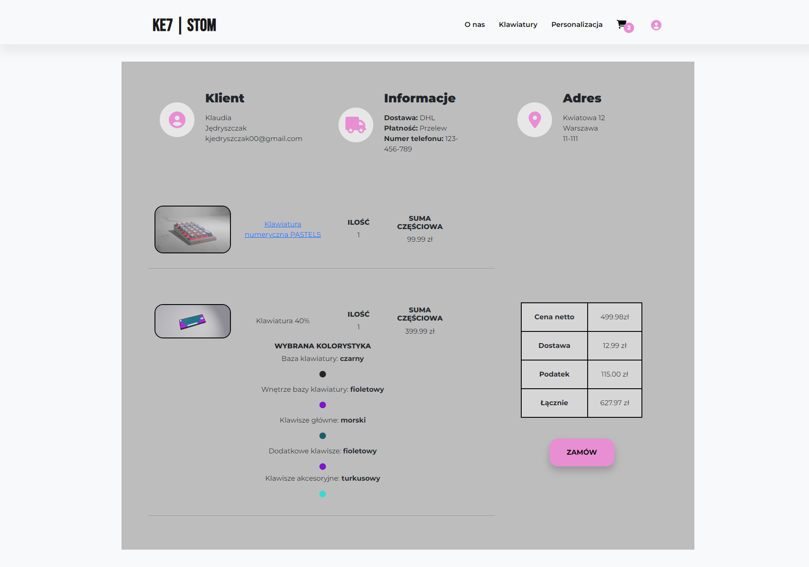

After placing an order the user is taken to order page where they can see all the neccessary information. Details about whether the order has been paid for and shipped are displayed. If the order has not been paid, an appropriate message appears at the bottom of the page along with a PayPal button allowing for payment of the order. When this button is clicked, a new window opens for the PayPal payment with the appropriate amount.

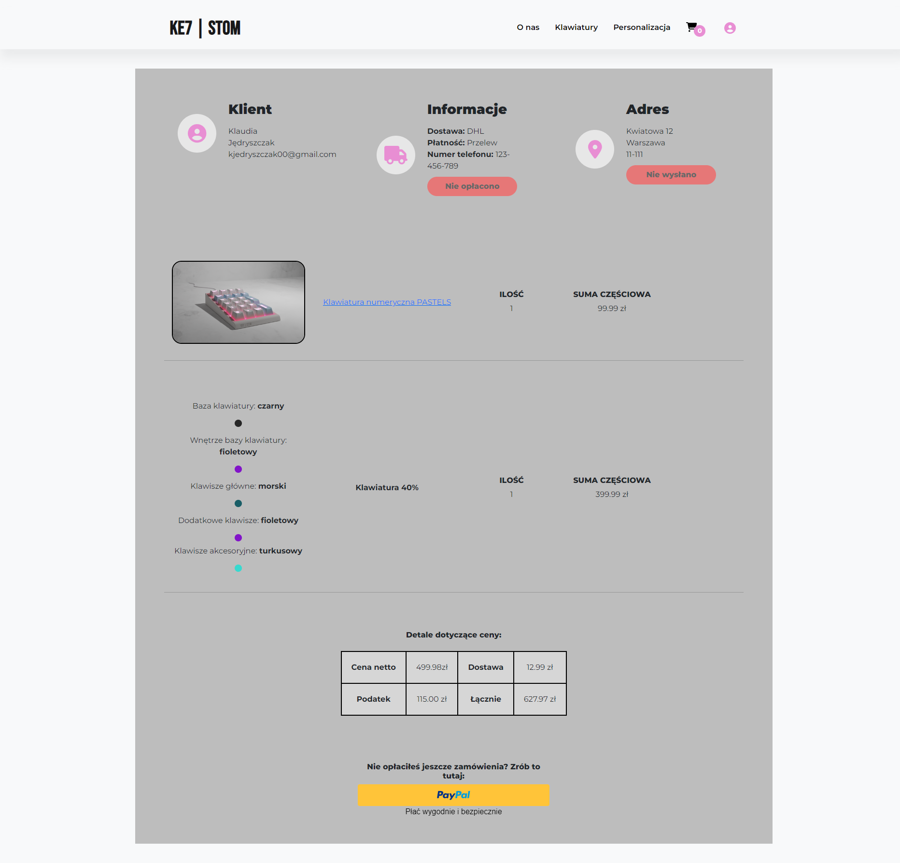

After the order has been paid, a relevant message is displayed indicating when it was paid, along with a notice at the bottom of the page that it will be shipped soon.

### User Account

The user account screen allows users to check and edit information about their account, as well as view a list of orders and track their status. The user profile enables tracking of information about the account and logging out by clicking the button in the upper right corner. To edit their profile, users must click the button in the lower left corner, and they can access the order list by clicking the "Zamówienia (Orders)" button. The number in the white circle indicates how many orders the user has.

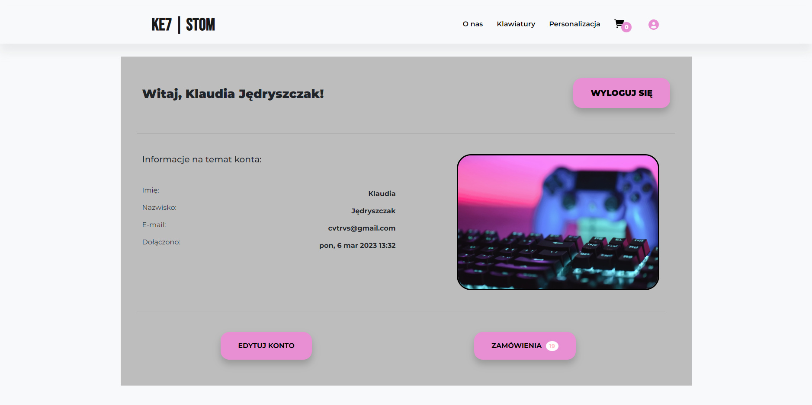

Profile editing is done through a form where new information can be entered, such as first name, last name, email, and a new password (which must be repeated). Changes are confirmed by clicking the Save Changes button. If the user enters different values in the new password and repeat password fields, the message about not matching passwords will apear.

The order list displays all orders from newest to oldest. Paid orders are highlighted in green, while unpaid orders are shown in red. The order ID also serves as a link to the detail page for that order.
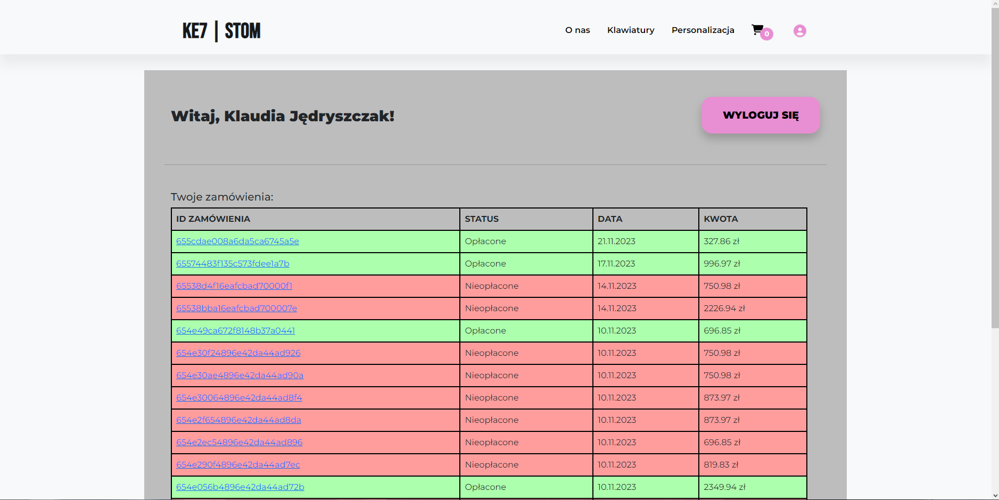

## Technologies Used

This section discusses the chosen technologies for implementing the project. The technologies are categorized into 3D graphics, frontend, and backend.

### 3D Graphics

#### Blender

Blender was chosen to create 3D keyboard models because it is free, open-source, fully functional without licensing costs and has a robust community providing support, advice, and resources. Blender’s extensive toolset is valuable for creating 3D models and offers export options that simplify integration with the web application.

#### Three.js

Three.js is a cross-platform JavaScript library and API for creating and displaying 3D computer graphics in web browsers using WebGL. Its source code is available on GitHub and allows for 3D animations using the GPU and JavaScript as part of a webpage, without the need for proprietary browser plugins.

#### React-three-fiber

React-three-fiber was chosen for its key benefits, enabling declarative 3D scene construction using React components, aligning with React’s state and component management approach. The technology stays current with Three.js updates.

### Frontend

#### React

React was chosen for its flexibility, efficiency, and adaptability across platforms. It supports many frameworks and libraries, such as react-three-fiber, react-paypal, and react-google-auth, which allow for integrating a 3D engine, PayPal payments, and Google authentication—features beneficial for creating an online store.

#### JavaScript

Key factors influencing JavaScript’s choice include its popularity and extensive use in the web ecosystem, ensuring abundant support and resources. React, as a JavaScript library, seamlessly integrates with it.

#### Redux Toolkit

Redux Toolkit was chosen for its streamlined state management and access to useful tools.

### Backend

#### Express.js

Express.js is one of the most popular Node.js frameworks, allowing for the creation of web, mobile applications, and APIs. It's a lightweight, flexible, and open-source framework that assists backend developers. All these features contributed to the decision to use Express in this project. It provides a solid foundation for building efficient and scalable servers for applications.

#### MongoDB

MongoDB is a popular open-source NoSQL database used for storing and retrieving data flexibly and scalably. Known for its ability to handle large amounts of data, MongoDB integrates with various programming languages and is designed to be user-friendly. Data is stored in JSON-like documents with optional schemas, organized into collections similar to tables in relational databases. The decision to use MongoDB was based on its NoSQL structure, which allows for flexible and dynamic data storage—beneficial for applications with evolving data structures.

---

## Navigation and Components

For a clear, intuitive UI, effective navigation management and component design were essential. Key principles and techniques include:

- **Component Structure**: Each component handles a specific function or view, making code management and reusability simpler. Components are stored in a `components` folder, with individual styles defined in a `style` subfolder. They are written as JavaScript arrow functions.
- **Navigation**: The `react-router-dom` library handles navigation, mapping each URL path to a specific React component, which renders when a user visits that path. Paths include:

  - **"/"**: renders the `Hero` component (homepage)
  - **"/about"**: renders the `About` component
  - **"/personalization"**: renders the `Personalization` component
  - **"/basket/:id?"**: renders the `Basket` component, where `:id?` is an optional parameter
  - **"/keyboard"**: renders the `Keyboard` component
  - **"/products/:id"**: renders `SingleProduct`, with `:id` representing the product ID
  - **"/login"** and **"/register"**: render `Login` and `Register` components
  - **"/search/:keyword"**: renders `Keyboard` with `keyword` used to filter products
- **Private Routes**: Available only to logged-in users, accessible under `"/"`. These routes include:

  - **"/profile"**
  - **"/delivery"**
  - **"/payment"**
  - **"/placeorder"**
  - **"/order/:id"** (with `:id` as the order identifier)
- **Navbar Component**: Always rendered as it is placed directly within `Router` but outside of `Routes`, enabling user navigation across components regardless of the current screen.

---

## Database Implementation

This section outlines the database schema and data model details.

### Database Schema

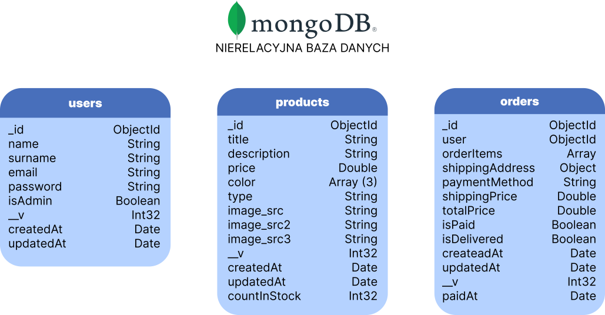

### Collections

#### Users Collection

Stores registered user data, including those registered via Google. Each user is uniquely identified to link orders to their account.

- **id**: `ObjectId` (unique user identifier)
- **name**: `String` (first name)
- **surname**: `String` (last name)
- **email**: `String` (email address)
- **password**: `String` (user password)
- **isAdmin**: `Boolean` (admin status)
- **__v**: `Int32` (versioning)
- **createdAt**: `Date` (record creation date)
- **updatedAt**: `Date` (last update date)

#### Products Collection

Stores information about products available for purchase, including standard (non-customizable) items.

- **id**: `ObjectId` (unique product identifier)
- **title**: `String` (product name)
- **description**: `String` (product description)
- **price**: `Double` (product price)
- **color**: `Array` (three color options)
- **type**: `String` (product type, e.g., keyboard size)
- **image_src / image_src2 / image_src3**: `String` (image paths)
- **__v**: `Int32` (versioning)
- **createdAt**: `Date` (record creation date)
- **updatedAt**: `Date` (last update date)
- **countInStock**: `Int32` (available stock count)

#### Orders Collection

Stores order details. The `orderItems` field holds both standard and customizable products.

- **id**: `ObjectId` (unique order identifier)
- **user**: `ObjectId` (user identifier)
- **orderItems**: `Array` (list of ordered items)
- **shippingAddress**: `Object` (delivery address)
- **paymentMethod**: `String` (payment method)
- **shippingPrice**: `Double` (shipping cost)
- **totalPrice**: `Double` (total order price)
- **isPaid**: `Boolean` (payment status)
- **isDelivered**: `Boolean` (delivery status)
- **__v**: `Int32` (versioning)
- **createdAt**: `Date` (record creation date)
- **updatedAt**: `Date` (last update date)
- **paidAt**: `Date` (payment date)
